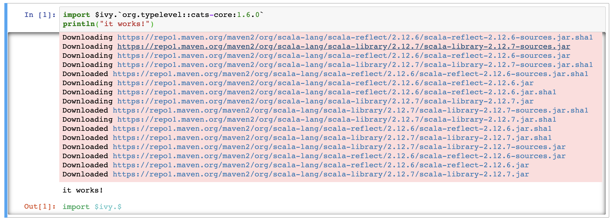

[](https://mybinder.org/v2/gh/hablapps/scalacrashcourse/master)

# Crash course in Scala

This repository contains the notebooks for the crash course in Scala offered by Habla Computing in collaboration with teachers of the University Rey Juan Carlos. The course was offered online through the [Madrid Scala Meetup group](https://www.meetup.com/Scala-Programming-Madrid). You can find links to recordings of the different sessions below.

## Outline

The course is divided into four online sessions:

* I - [Object oriented programming](https://www.meetup.com/Scala-Programming-Madrid/events/269663119/)
* II - [Functional programming](https://www.meetup.com/Scala-Programming-Madrid/events/269663203/)
* III - [Generics](https://www.meetup.com/Scala-Programming-Madrid/events/269663464/)
* IV - [Implicits](https://www.meetup.com/Scala-Programming-Madrid/events/269663696/)


## Installing docker and runing the notebooks

1. Install docker on your machine if you don't have it

    1.1 [Linux](https://docs.docker.com/install/linux/docker-ce/ubuntu/)

    1.2 [Windows](https://docs.docker.com/docker-for-windows/install/)

    * If your windows is not 10 pro, install this one [Windows](https://docs.docker.com/toolbox/toolbox_install_windows/)

    1.3 [MAC](https://docs.docker.com/docker-for-mac/install/)

2. Clone this repository

    2.1 Open a terminal

    2.2 Go to the folder you want to download de repo

    2.3 Run this command
    ```bash
    git clone https://github.com/habladev/formacion-capgemini.git
    ```

    2.4
    ```bash
    cd {nombre del proyecto}
    ```
3. Run the docker

    3.1 Make sure that docker daemon is running and run this command

    3.2
    * Linux / MAC

    ```bash
    docker run -it --rm -p 8888:8888 -p 4040:4040 -m 4g -v "$PWD":/home/jovyan/work almondsh/almond:0.9.1-scala-2.12.10
    ```

    * Windows

    ```bash
    docker run -it --rm -p 8888:8888 -p 4040:4040 -m 4g -v "${pwd}:/home/jovyan/work" almondsh/almond:0.9.1-scala-2.12.10
    ```

    If it is the first time running this, it can take a while to download the images.

4. Enter in Jupyter

    4.1 Copy the token that is showed in the terminal
    ```
    Copy/paste this URL into your browser when you connect for the first time, to login with a token:
    http://(824918044eeb or 127.0.0.1):8888/?token=57c1a89124a898d1c6d4ca404445c9b54c9c6d6cfc558f9f
    ```


    4.2 go to [localhost](http://localhost:8888) paste the token and log in.
    

5. Test Notebook

    5.1 In Jupyter open with a click the work folder

    5.2 Open with a click the `Test notebook`

    5.3 Press the run button, if yo don't see any errors and at the end you see `it works!` you have all up and running.

    


6. Close the jupyter container

    ```
    Atention!
    ```

    Make sure that you save everything previously to close Jupyter. The docker parameter `--rm`- deletes the container (the image is still in your machine), to a clean the enviroment each time you open it, but also discards all non saved changes in the notebooks.

    6.1 Go to the shell that is running the container

    6.2 Control + c to send a kill signal

    6.3 Type 'y' and enter to finish.
